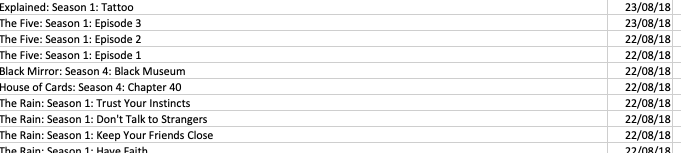

# Analysing Netflix Viewing patterns

In this project, I tried to analyse my own Netflix viewing patterns, and do a comparative analysis. 

Recently, I was going through my Netflix’s “My Account” page and realised that you could download your profiles viewing activity in a csv format, I immediately thought it would be pretty cool to visualise my Netflix usage. Lately, i have been practicing my python skills, this seemed like a good opportunity to use Matplotlib / seaborn libraries.

Though, i was set up for disappointment, because this is the data that Netflix exported:

The csv file had only 2 columns, **date **and the **name of the show /season / episode** in one column.

I figured, there isn’t much i can do about this and had thought of giving up on this project, but then again i didn’t want to give up so easily, besides this is the essence of working with the data, figuring out how to make things work. I took it up as a challenge for myself to atleast be able to get two visualisations out of this to figure out some insights into my Netflix related behaviours.

Since i had only 2 columns to deal with, i started tinkering with the pandas data functions to get more out of these columns and by the time i finished, I managed to go from 2 columns to 10 columns in the dataset. I replicated the same process for my wife’s Netflix profile , in order to do an comparison of our viewing habits.

First things first, lets start with the visualisations that i could extract from the data. Here they are:

Read more about my steps and my thought process [here.](https://gaurang.swarge.com/blog/analysing-your-netflix-viewing-patterns)
